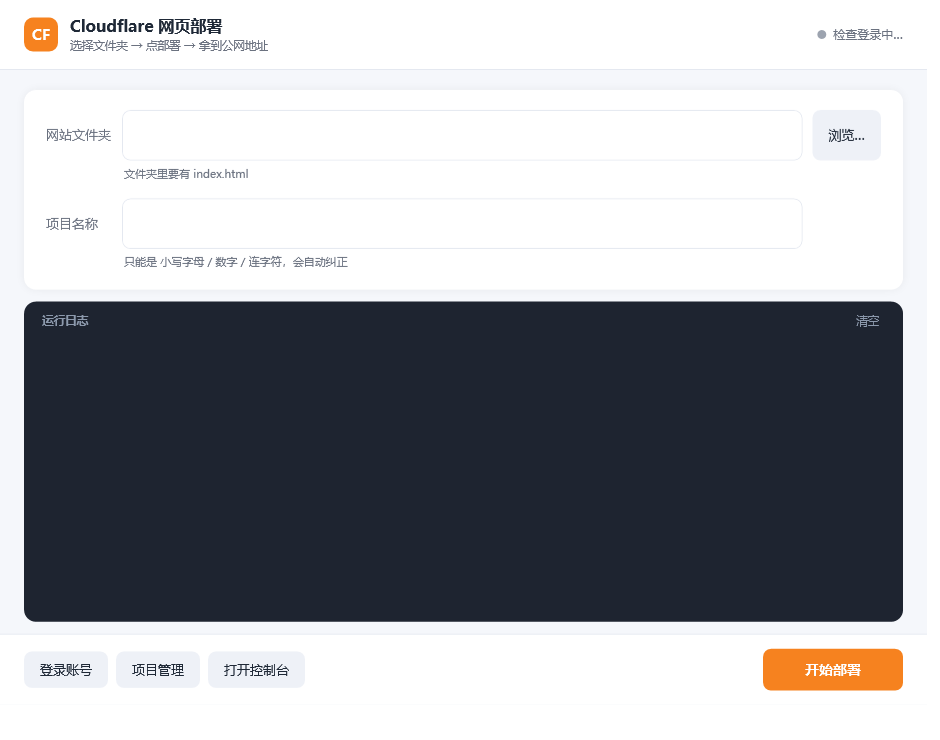

# Cloudflare Pages Deployer

一个图形化工具，把本地网页文件夹一键发布到 Cloudflare Pages，拿到公网网址。不用记命令行。



> **平台**：Windows 10 / 11 · **依赖**：无（`init.bat` 自动安装 Node.js 与 wrangler）· **许可证**：MIT

### 30 秒上手

```cmd
init.bat     :: 首次运行：自动检查并安装所需组件
start.bat    :: 打开界面
```

然后：选文件夹 → 填项目名 → 点「开始部署」。

---

## 目录

- [一、拿到项目后第一步](#一拿到项目后第一步)
- [二、怎么用](#二怎么用)
- [三、常见问题](#三常见问题)
- [四、卸载 / 清理](#四卸载--清理)
- [五、系统要求](#五系统要求)
- [六、目录结构（开发者参考）](#六目录结构开发者参考)
- [七、技术说明](#七技术说明)
- [八、许可证](#八许可证)

---

## 一、拿到项目后第一步

### 1. 解压到任意目录

建议放在一个**路径不含中文和空格**的位置，例如：

```
D:\tools\cloudflare-pages-deployer\
C:\dev\cloudflare-pages-deployer\
```

> ⚠️ 不建议放在桌面、也不建议放在 `C:\Program Files\` 下（可能需要管理员权限）。

### 2. 双击 `init.bat`

它会自动完成：

| 步骤 | 检查项 | 缺失时 |
|---|---|---|
| 1/6 | PowerShell | Win10/11 自带，不会缺 |
| 2/6 | Node.js | **自动用 winget 安装**（装完需重开窗口再跑一次）；无 winget 时打开下载页并给出步骤 |
| 3/6 | npm | Node 自带 |
| 4/6 | wrangler | **自动用 npm 安装** |
| 5/6 | Cloudflare 账号与登录 | **询问是否有账号 → 无则打开注册页 → 自动打开浏览器授权** |
| 6/6 | 最终校验 | 确认 Node 与 wrangler 均可用 |

看到 `Setup complete.` 就成功了。

### 3. 双击 `start.bat`

图形界面打开，开始用。

> 想双击不闪黑窗？双击 `start-silent.vbs`，或者右键它 →「发送到」→「桌面快捷方式」。

---

## 二、怎么用

### 界面说明

```
┌────────────────────────────────────────────────────────────┐
│  [CF] Cloudflare 网页部署          ● 已登录：you@mail.com   │  ← 绿点=已登录
├────────────────────────────────────────────────────────────┤
│                                                            │
│  网站文件夹  [ D:\my-site              ] [ 浏览… ]          │  ← 选要发布的文件夹
│              已检测到 index.html ✓                          │
│                                                            │
│  项目名称    [ my-site                 ]   → https://...    │  ← 决定网址前缀
│              只能是 小写字母/数字/连字符，会自动纠正          │
│                                                            │
├────────────────────────────────────────────────────────────┤
│  运行日志                                                   │
│  12:00:01 [执行] 上传文件 : wrangler pages deploy ...       │  ← 实时进度
│  12:00:03 [OK]   部署成功！                                 │
├────────────────────────────────────────────────────────────┤
│  [登录账号] [项目管理] [打开控制台]   ▬▬▬▬   [ 开始部署 ]    │  ← 主操作
└────────────────────────────────────────────────────────────┘
```

### 发布一个网页（三步）

1. **点「浏览…」** 选择你的网页文件夹（里面要有 `index.html`）
   - 选好后，下方的提示行会告诉你有没有检测到 `index.html`
2. **填「项目名称」** —— 比如填 `my-site`，最终网址就是 `https://my-site.pages.dev`
   - 只能用小写字母、数字、连字符。乱填会自动纠正（如 `My Site!` → `my-site`）
3. **点「开始部署」** —— 日志区实时显示上传进度，成功后弹窗问你要不要打开浏览器

### 其他按钮

| 按钮 | 作用 |
|---|---|
| 登录账号 | 授权过期时点它重新登录（会打开浏览器） |
| 项目管理 | 查看所有项目；可打开站点，或删除项目（**不可恢复**） |
| 打开控制台 | 跳转到 Cloudflare 官网后台，配置自定义域名等高级功能 |
| 清空 | 清掉日志区内容 |

---

## 三、常见问题

### 我没有安装任何工具，能直接用吗？

可以。**不需要提前装任何东西**。`init.bat` 会自动检查并安装全部依赖：

| 情况 | init.bat 的行为 |
|---|---|
| 什么都没装 | 自动装 Node.js（winget）→ 自动装 wrangler → 引导你注册/登录 |
| 已装 Node.js | 跳过，直接装 wrangler |
| 全都装了 | 只做校验，几秒钟结束 |
| 没有 winget（老系统） | 自动打开 Node.js 下载页，并给出图文步骤 |
| 没有 Cloudflare 账号 | 询问后打开免费注册页，注册完回来继续 |

**唯一的注意点**：如果 init.bat 帮你装了 Node.js，它会要求你**关掉窗口再运行一次 init.bat**（新装的程序需要重开窗口才能被识别）。这是 Windows 的机制，不是 bug。

### 没有 Cloudflare 账号怎么办？

免费注册，约 1 分钟：

1. `init.bat` 第 5 步选 `[2] No, I need one`，会自动打开注册页
2. 或者在浏览器访问 https://dash.cloudflare.com/sign-up
3. 填邮箱 + 密码，去邮箱点验证链接
4. 回来继续，脚本会打开浏览器让你点「Allow」授权

工具不保存你的密码，授权令牌只存在你本机（`%APPDATA%\xdg.config\.wrangler\`）。

### 双击 init.bat / start.bat 闪一下就没了？

说明有报错但来不及看。用命令行运行就能看到原因：

```cmd
cd /d 你的项目路径
init.bat
```

常见原因：

| 现象 | 原因 | 解决 |
|---|---|---|
| 提示 Node.js not found 且 winget 也失败 | 系统太旧没有 winget | 按提示手动装 Node.js（https://nodejs.org/ 选 LTS） |
| 提示 wrangler install failed | 网络慢或代理问题 | 见下方「网络慢怎么办」 |
| 窗口瞬间关闭无任何提示 | 杀毒软件拦截脚本 | 把项目文件夹加入白名单 |
| 提示 PowerShell not found | Windows 版本过旧 | 需要 Win10/11 |

> `start.bat` 现在已内置前置检查：缺组件时不会静默失败，而是弹出提示并询问是否直接运行 `init.bat`。
> `start-silent.vbs` 同理，会用对话框告诉你缺什么。

### 网络慢 / 装不上 wrangler？

国内网络建议切 npm 镜像源：

```cmd
npm config set registry https://registry.npmmirror.com
npm install -g wrangler
```

如果公司网络需要代理：

```cmd
set HTTPS_PROXY=http://你的代理地址:端口
npm install -g wrangler
```

### 部署成功但网址打不开？

- **首页 404**：所选文件夹根目录下必须有 `index.html`
- **刚部署完访问不到**：CDN 有几十秒到几分钟的缓存，等一下再刷新
- **网址格式**：是 `https://项目名.pages.dev`，不是 `https://项目名.pages.dev/xxx`

### 部署的是框架项目（Vue / React / Vite）？

先构建，再把**产物目录**作为网站文件夹：

```cmd
npm run build
```

然后选 `dist`（或 `build`、`out`，取决于框架）文件夹。

### 项目名写错了想改？

Cloudflare 的项目名**创建后不可修改**。做法：

1. 用新名字重新部署一次（改「项目名称」再点部署）
2. 点「项目管理」，选中旧项目，点「删除选中项目」

### 会不会把我的代码传到别的地方？

不会。文件只上传到你**自己的** Cloudflare 账号（就是登录时授权的那个账号）。所有操作都在你的账号内，工具本身不经过任何第三方服务器。

### 多个网页怎么管理？

每个网页 = 一个项目名 = 一个网址。比如：

- `blog` → `https://blog.pages.dev`
- `resume` → `https://resume.pages.dev`
- `demo` → `https://demo.pages.dev`

在界面里只需改「网站文件夹」和「项目名称」两栏，点部署即可。

---

## 四、卸载 / 清理

本工具**不写入系统**，删除项目文件夹即可。

如果想彻底清理：

```cmd
npm uninstall -g wrangler
```

然后在 Cloudflare 后台或工具的「项目管理」里删除不用的项目。

---

## 五、系统要求

| 项目 | 要求 |
|---|---|
| 操作系统 | Windows 10 / 11 |
| PowerShell | 5.1+（系统自带） |
| Node.js | 14+（init.bat 可自动装） |
| wrangler | 3.0+（init.bat 可自动装） |
| 网络 | 能访问 cloudflare.com 和 registry.npmjs.org |
| 账号 | 需要一个 Cloudflare 账号（免费注册） |

---

## 六、目录结构（开发者参考）

```
Cloudflare Pages Deployer/
├── init.bat              环境初始化（检查+安装依赖+登录）
├── start.bat             启动界面（带控制台，便于看报错）
├── start-silent.vbs      静默启动（无控制台窗口）
├── test.bat              运行自检
├── requirements.txt      依赖清单
├── README.md             本文件
├── 使用说明.md            小白快速上手
├── CONTRIBUTING.md       开发约定
├── LICENSE               MIT 许可证
├── preview.png           界面截图
├── src/
│   ├── main.ps1          程序入口
│   ├── Ui.ps1            界面定义（XAML）
│   ├── Wrangler.ps1      wrangler 命令封装
│   └── App.ps1           业务逻辑
├── tests/
│   └── smoke.ps1         自检脚本
└── tools/
    └── capture.ps1       界面截图工具（开发用）
```

### 自检

```cmd
test.bat
```

会检查模块完整性、语法、项目名转换、wrangler 可用性、登录状态、项目列表。

### 改代码的注意事项

- **`.bat` / `.vbs` 文件必须保持纯 ASCII**（不能有中文），否则 cmd 在 GBK 代码页下解析会错乱
- **`.ps1` 文件必须存为 UTF-8 with BOM**，否则 PowerShell 5.1 读中文会乱码

改完 `.ps1` 后修正编码：

```powershell
$f = 'src\App.ps1'
$t = [IO.File]::ReadAllText($f, [Text.UTF8Encoding]::new($false))
[IO.File]::WriteAllText($f, $t, [Text.UTF8Encoding]::new($true))
```

更详细的开发约定见 [CONTRIBUTING.md](CONTRIBUTING.md)。

---

## 七、技术说明

- **纯 PowerShell 5.1 + WPF** 实现，无 Python、无额外运行时依赖
- 所有外部命令调用集中在 `src/Wrangler.ps1`，便于替换或测试
- 调用 wrangler 统一使用 `cmd /c call "wrangler.cmd" <args>`，并强制以 UTF-8 读取输出
  （避免 GBK 环境下表格输出乱码导致解析失败）
- 不收集任何用户数据，不向第三方发送任何信息

---

## 八、许可证

本项目基于 [MIT License](LICENSE) 开源。

Cloudflare、Cloudflare Pages、wrangler 是 Cloudflare, Inc. 的商标或注册商标。
本项目与 Cloudflare, Inc. 无隶属关系，仅调用其官方 CLI 工具。

---

## 相关链接

- [Cloudflare Pages 官方文档](https://developers.cloudflare.com/pages/)
- [wrangler CLI 文档](https://developers.cloudflare.com/workers/wrangler/)
- [问题反馈](https://github.com/Li-Junze/Cloudflare-/issues)
